# 中小企业云门户ORK使用手册
简洁的 OKR 工具，丰富的实践方法，让组织向着一致方向前进。  
> + 公开透明的线上看板，轻松保持个人与组织目标一致；  
> + 实时高效的跟进和沟通，目标管理过程更加敏捷；  
> + 可视化的数据看板，复盘企业 OKR 执行情况。

点击OKR目标管理，进入OKR页面。点击上方的仪表板、一览、树按钮可以切换不同的OKR显示方式。点击右上角的按钮，可以切换不同的年度、季度，查看对应的OKR。

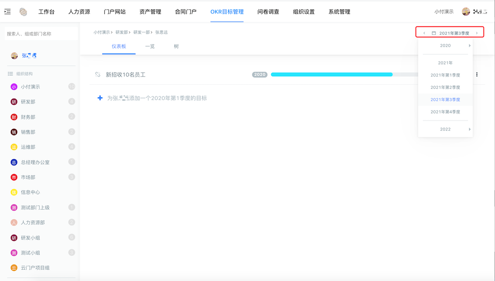

点击左侧的组织结构，可以查看、编辑部门、个人的OKR。

**注：有OKR按钮权限的员工可以查看、编辑公司、部门、员工的OKR，只有OKR菜单权限的员工只能编辑自己的OKR以及查看其他人和组织部门的OKR。**

## 1 仪表板
在仪表板这里，我们可以进行新建、修改、删除OKR的目标（Objective）、关键结果（KeyResult）、评论。
### 1.1 目标（Objective）
单击“＋”后边（这时“+”图标会变成另外一个图标），为当前选择的部门或个人添加一条OKR，回车键确认输入。

**注：“+”图标仅仅只是图标，不是按钮，添加目标点击的是“+”后边空白处。**

目标添加完成后可以点击目标前边的链接按钮，把当前目标关联到其他目标上。一般而言，个人目标关联到部门目标上，部门目标关联到公司目标上。也可以选择关联到其他目标，或者不关联。

可关联目标页只显示4个目标，若关联目标未显示，在上方输入关键字，查询即可。

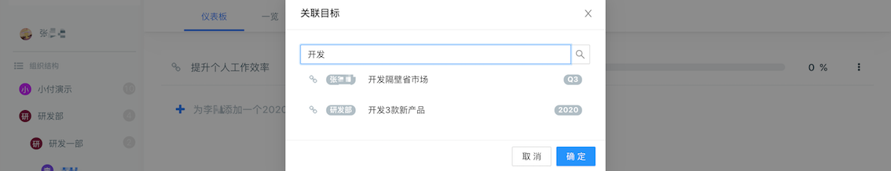

点击想要关联的目标前边关联按钮即可关联目标，再次点击取消关联。

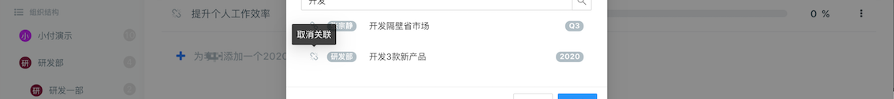
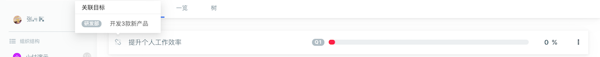

点击已存在的目标可以查看目标的详细信息，点击目标后边的按钮，可以修改、删除目标。

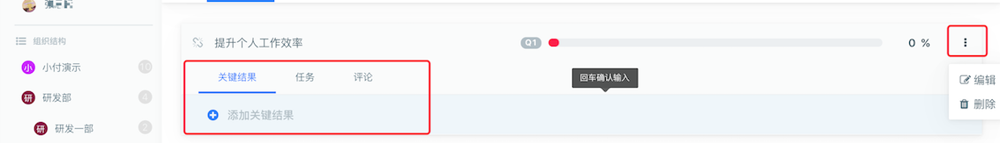

点击目标下边评论一栏，可以为目标添加评论。添加方式与添加目标一致，点击文字处，输入内容，回车键确定。

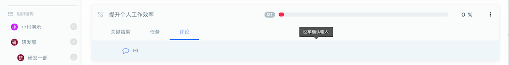
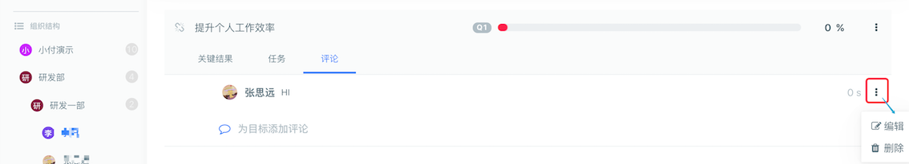

评论添加完成后，点击评论后边的按钮可以编辑删除评论。

**注：评论内容只能评论者本人编辑、删除，管理员无操作权限。**

### 1.2 关键结果（KR、KeyResult）
点击目标下方的关键结果一栏，可为目标设置KR。KR可以存在多条。  
点击KR最右边的按钮，可以编辑、删除KR。  
点击KR的进度条，可以拖动修改KR进度。同时KR的进度也影响着目标的进度条。

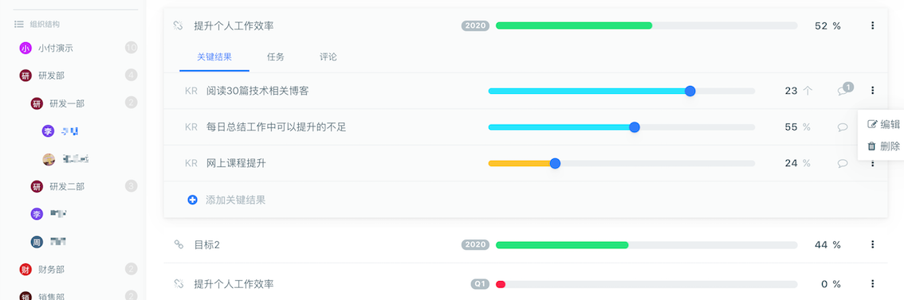

也可以点击后边的数字修改进度。

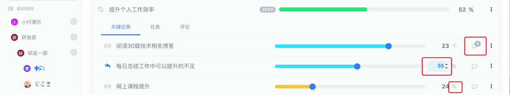

点击数字后边的单位按钮，可以修改单位和KR在该目标中的权重。

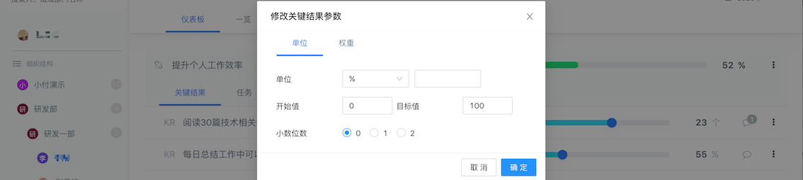
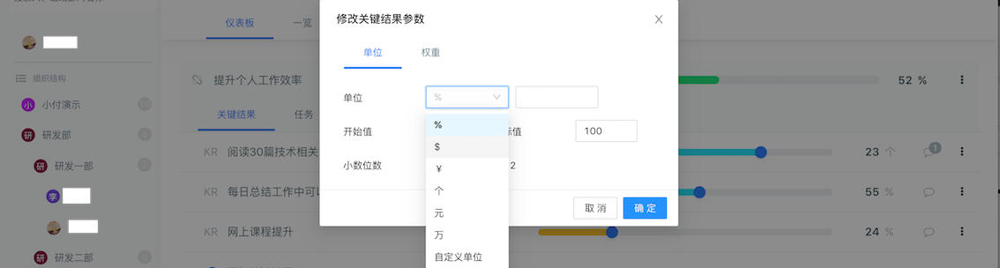
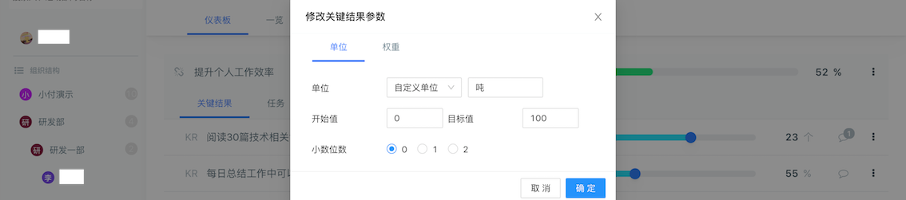
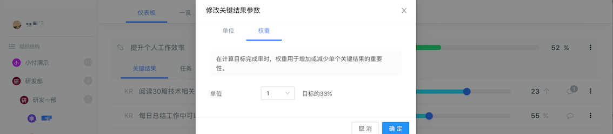

点击KR的评论按钮，为KR添加评论。

点击评论后边的按钮可以编辑删除评论。
## 2 一览
在一览一栏中，我们将以卡片的形式展示OKR。我们同样可以在这里添加目标、KR，但是不能添加评论、关联目标、单位和权重。

点击目标右上角的按钮，可以编辑、删除目标。

点击目标可以查看目标的KR，点击目标下边的新建按钮可以新建KR。

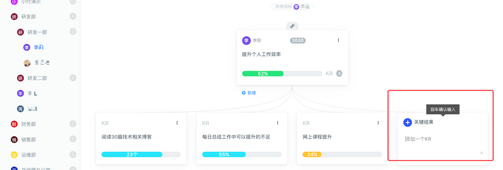

点击KR右上角的按钮可以编辑、删除KR。

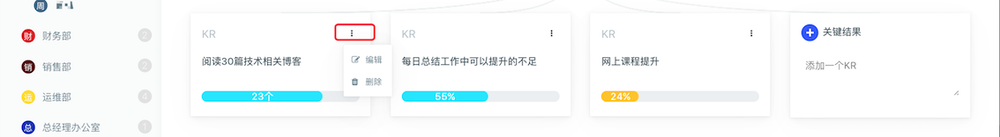

点击目标上方的关联按钮，可以查看关联目标。

点击所有目标可以回到所有目标页。

## 3 树
在树一栏中，我们将以树的形式展示OKR。

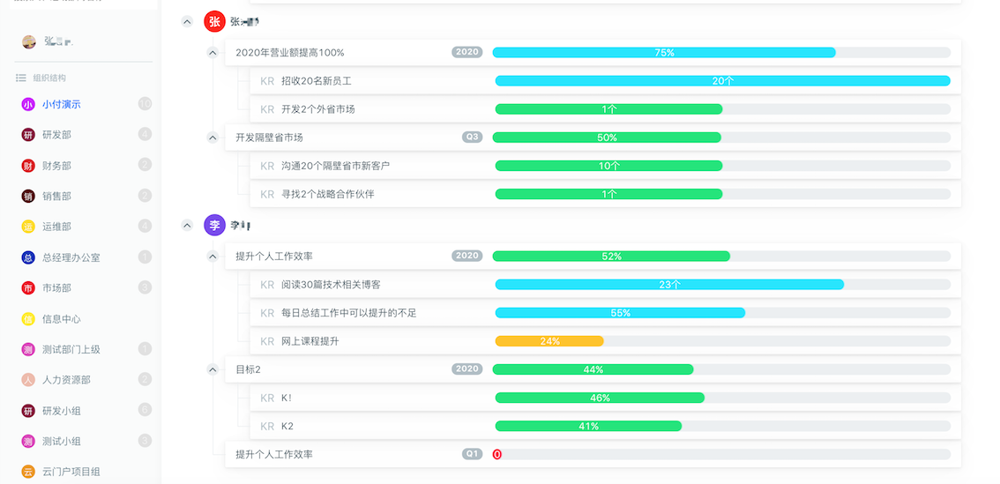

