# 中小企业云门户人力资源手册(新版)
浏览器输入：https://www.icloudportal.com/home 访问我们的网站。  

点击左上角菜单按钮，选择工作台，登陆我们新版云门户人力资源管理系统。

已有账户用户直接输入账户密码登陆即可，绑定手机账户可以手机号码登录，绑定微信公众号账户可以微信扫码登录，公文包app用户可以使用公文包内扫码功能登录。

没有账户的用户可以点击注册按钮免费注册。

登陆成功后，可以点击右下角姓名，在弹出页选择个人中心来设置个人信息、修改登陆密码、绑定手机密码（绑定后可以电话号码加短信验证码登陆）、绑定微信/解绑（绑定后可以在微信公众号打卡、审批、接收任务便签等消息）。

点击可左边头像，可以在弹出界面上传头像，也可以直接使用摄像头截图。

新版云门户人力资源管理系统包含：

工作台、人力资源、门户网站、资产管理、合同门户、OKR目标管理、问卷调查、组织设置、系统管理9大模块。其中模块需要使用云豆购买（系统初始赠送12000云豆），如有其它需要，请邮件联系：support@icloudportal.com 

## 1 工作台
工作台页面所有员工可见，是员工个人的办公区域，包含动态管理、我的任务、资料库等功能，其中工作日历、客户名片、我的工资单功能仅供高级版订阅会员企业使用，请邮件联系：support@icloudportal.com

### 1.1 动态
在动态中，可以向其它员工发送便签消息、任务，发布通知公告功能仅供高级版订阅会员企业使用。查看、回复、点赞发送给我的消息、任务。如果绑定了微信公众号，还会在微信收到消息的推送。
#### 1.1.1 便签消息

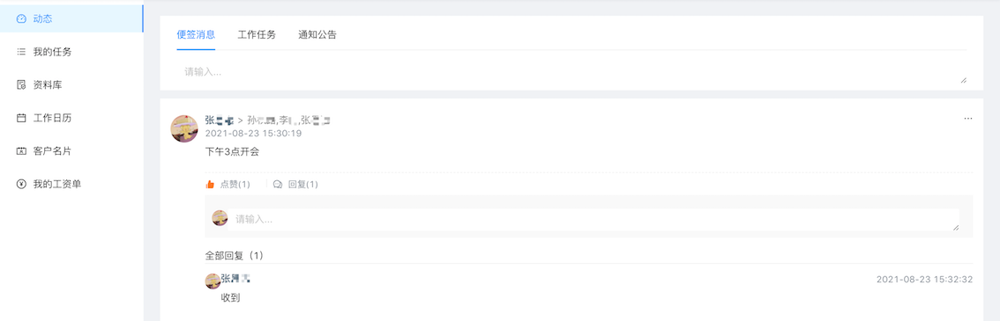

#### 1.1.2 工作任务

点击任务可以跳转到任务界面，查看任务详情

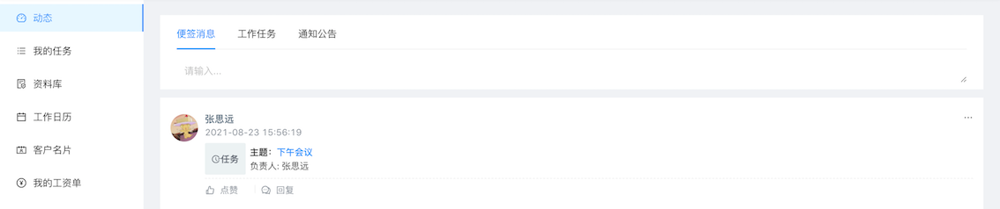

### 1.2 我的任务 
可随时反馈工作任务和有效跟踪，也可以随时为其他同事分派任务。  

进入我的任务界面，可以根据参与情况来查看任务，如”我参与的“、”我分配的“、项目关联、OKR目标关联等。通过右上角的按钮也可以切换任务列表。

右下角的新建按钮可以新建任务分栏，各个分栏内的任务可以拖动调整，根据自己的习惯来放置任务。

点击分栏右上角可以修改分栏名称、删除分栏，分栏内存在未删除、已归档的任务无法删除。

**注：建议单独建立一个归档分栏，把要归档的任务放到该分栏，再进行归档操作。**

点击添加新任务可以创建任务，结束日期、负责人等可以先不配置，在编辑任务时填写。

任务创建完成后可以点击任务后边的编辑按钮，设置任务的详细信息。

勾选重复任务按钮，可以设置按每月、每日等周期的循环任务，设置定点提醒任务。

点击任务前的完成按钮，可以完成任务。

也可以点击任务名称开启编辑，不同于上边的编辑按钮，此处编辑的内容没有重复任务相关设置，而是兼容了旧版云门户任务协作的的归档、评论功能，新增了删除任务功能。 

**注：新版任务模块，新建的任务只有选择的参与人员能在旧版云门户中看到该任务，在归档中查看归档的任务。**  

**注：目前新版任务中未设置查看归档界面，请在旧版云门户任务协作中查看归档任务。**

### 1.3 资料库
> + 随时随地上传、分享数据与协同办公，帮助工作高效完成。
> + 在线编辑文档。    

点击资料库可以跳转到资料库页面，也可以直接访问：https://files.icloudportal.com 登陆资料库。每个账户拥有2GB空间，如需扩容，请联系我们。

点击右上角头像按钮，点击设置，可以设置用户个人信息。

#### 1.3.1 我的资料库
第一次登陆时，在我的资料库一栏中，只有私人资料库，点击新建资料库按钮，创建新的资料库，勾选加密按钮则为该资料库设置密码，需要密码才能打开此资料库。

**注：需要密码打开的的资料库，打开时输入密码，之后1小时内无需再输入密码即可打开。**

资料库名称前边的图标可以区分资料库的类型，也可以悬停在图标上，会显示类别名称。图标前边的收藏⭐️按钮点击可以将该资料库收藏，在收藏夹中可以看到该资料库。 

当鼠标悬停在某一资料库时，会出现3个按钮，分享、删除、更多。

点击共享按钮弹出共享页面，可以设置共享链接、上传链接、共享给用户、共享给群组。  

**注：加密数据库只有共享给用户和共享给群组两个选项。**  

在共享链接中，可以设置密码、过期日期、查看与下载权限，设置完成后点击生成链接按钮，即可获得共享链接。

可以复制链接发送给分享的人，也可以点发送按钮，将链接发送到邮箱。

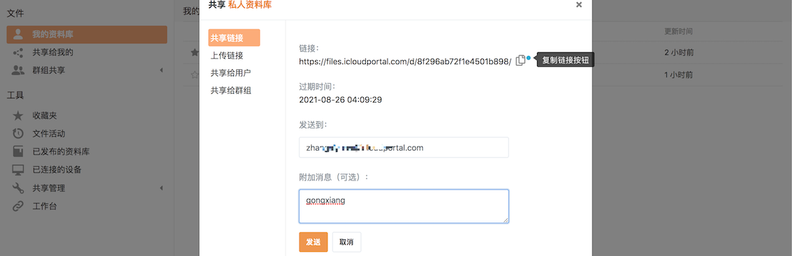

接收到链接后可以在浏览器上输入链接查看、编辑、下载共享的文件。

上传链接分享后，输入链接可以在资料库中创建文件夹、上传文件。

在共享给用户中，可以把资料库共享给多人，并设置不同的权限。被共享者可以在”共享给我的“一栏中查看其他人共享给本人的资料库。  

**注：用户筛选功能，目前只支持查找同一组织内、同一邮箱后缀、登陆过资料库系统的用户。**

在共享给群组中，可以选择在群组共享一栏中设置的群组，给予不同的权限共享。群组参与者可在群组共享中对应的群组中查看、编辑等。

点击删除按钮可以删除资料库，点击上方的更多按钮，可以查看已删除的资料库。点击删除的资料库后边的还原按钮，可以还原资料库。  

**注：30天前删除的资料库会被自动清空。**  

**注：删除并还原的资料库，之前的分享都会失效。**

点击资料库后边的更多按钮，可以给资料库重命名、转让资料库给个人、设置资料库历史信息保存时间、设置目录权限。

#### 1.3.2 资料库文件管理
点击资料库名称，进入资料库文件管理页面，在这里可以对文件进行上传、编辑、版本管理等操作。

点击上传按钮，可以上传文件、文件夹目录。若上传同名文件时，选择替换，则会覆盖原有文件，点击文件后边更多按钮中的历史按钮，可以看到之前覆盖的文件，实现版本管理，可以下载、查看。

点击新建按钮，可以新建文件夹、word、Excel等文件。

新建旁边的共享按钮功能同资料库共享，共享按钮后边3个按钮未切换文件显示形式按钮，可根据个人喜好选择。

点击布局按钮右侧的修改内容按钮，可以查看文件的详细信息、修改标签、添加相关文档、查看及添加评论。

点击标签管理按钮，可以查看、编辑、新建、删除标签。

点击标签还可以筛选属于该标签的文件。

点击回收站按钮，可以查看、还原已经删除的文件。

点击回收站右侧的历史按钮，可以查看资料库的修改历史记录，可以查看历史镜像，还原之前操作的文件。

文件前边的选择按钮，支持多选，勾选后，原上传按钮处会变成新的按钮，支持批量共享、复制、删除、下载功能。 

星标按钮勾选后收藏该文件，可以在收藏夹中查看。

云门户数字资料库还提供了在线编辑Word、Excel、PDF等文件的功能，点击文件名称即可进入编辑界面。  

编辑时，系统会锁定该文件（文件处有特殊标记），其他人无法编辑。编辑完成后，会在几分钟内自动解锁，也可以在更多按钮处手动解锁。

点击文件后方的下载、删除按钮可以下载、删除文件。  

点击共享按钮，可以共享该文件，其中共享链接与资料库共享链接相同，而内部链接是指向文件或目录的链接，只有对该文件或目录有访问权限的人可以访问。

文件后边的更多按钮还提供了文件重命名、移动、复制、标签管理、锁定、评论、历史等功能。

在访问日志中，还可以查看都有谁访问了该文件。

#### 1.3.3 群组共享管理
在所有群组中，可以看到该账户所在的所有群组。点击上方的新建群组按钮可以新建群组。

在已创建的群组栏中，可以管理该群组。

点击群组设置按钮，可以重命名、转让群组，管理群组成员，删除群组。

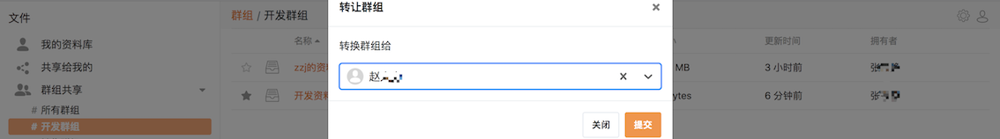

点击群组成员按钮，可以查看现有群组成员。

#### 1.3.4 工具相关
在收藏夹中可以看到收藏的星标文件、资料库，也可以在这里取消星标。

在文件活动中，可以查看整个资料库的操作记录。

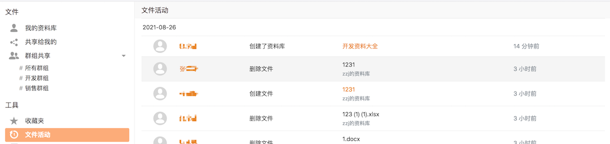

公开资料库用于以有组织的方式发布您的内容，在已发布的资料库中可查看，点击上方的发布资料库按钮来发布资料库。

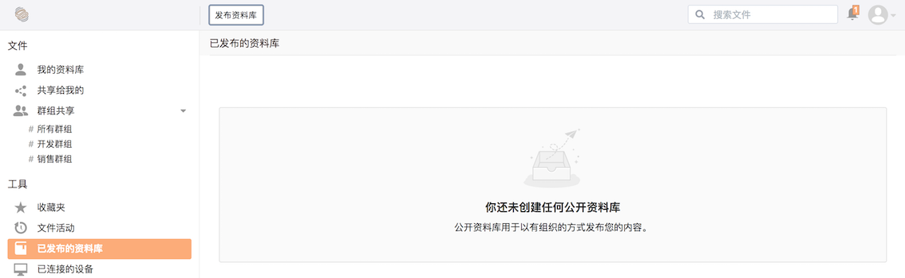

在已连接的设备处查看链接改资料库的设备。

在共享管理处可以查看共享的资料库、文件夹、链接。

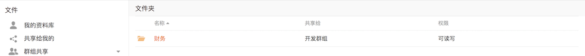

## 2 人力资源
以员工行为过程的信息管理和制度管理为核心，为企业解决人才数据管理、人才价值创造、人才协作沟通、人才数据分析等问题。  
在人力资源模块，进入就会看到概览页面，这里展示了组织的员工数量、招聘概况、员工分布等多方面的人力资源相关的图表。

在概览中点击右上角的编辑按钮，可以编辑概览页，增减图表组件，调整图表大小，拖动图表组件还可以调整布局。

其中假勤管理、绩效考核、薪酬管理、档案管理、员工服务模块仅供高级版订阅会员企业使用，请邮件联系：support@icloudportal.com
### 2.1 组织人事
从员工入职、签订合同到异动调转，再到离职管理，你需要的都可在这里实现。  
#### 2.1.1 人员信息
在人员信息中，可以查看、搜索、编辑员工信息。

点击切换按钮，可以将员工显示由卡片形式转为列表形式，并设置列表显示项。

点击上传按钮，可以批量导入新员工，点击下载员工导入模板，也可以点击下方的链接下载模板。也可以在统计报表中下载员工花名册，批量修改员工信息，在此处上传可以批量改变员工信息。  

**注：批量导入的员工仅限未注册登陆过云门户的账号，已注册的账号请入职管理中邀请。**

[点我下载员工导入模板](https://files.icloudportal.com/f/45ed33bc7b184a7288f9/?dl=1)

点击员工卡片，可以查看编辑员工信息。

在标签处，可以添加删除标签

在打印区域，可以下载、打印入职登记表、员工信息表、员工详情表。

在工作信息一栏，可以查看编辑在职信息、员工状态、任职记录、奖励记录、惩罚记录、考察期信息、人事档案信息、退休信息。其中部分项目（例如部门、职位）新建组织是没有选项的，需要在部门、组织信息的设置中设置完成才会有选项。有些项目我们提前预制了一些选项，也可以在设置中设置符合自身公司的选项。

在个人信息一览，可以查看编辑基本信息、教育经历、工作经历、语言能力、工作技能、职称、证书/证件、培训经历。

在联系信息页面，可以查看编辑主要联系信息、紧急联系人、家庭成员。

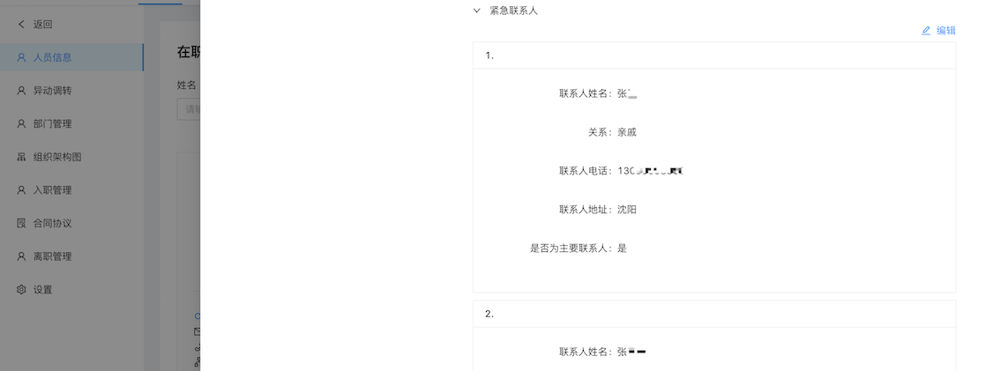

在工资社保页面可以查看编辑工资卡信息、社保公积金信息。

在合同协议页面，可以查看该员工签署的合同协议。

#### 2.1.2 异动调转
在异动调转页面，可以查看、新增员工的工作调动情况。  
在查询区域可以按照姓名、调转类型来精确查询。在调整显示取悦，可以刷新数据、调整显示密度、调整显示列项。

点击添加调动按钮，新增异动调转。调动人员可以按部门、职位筛选，没有部门、职位的员工直接选人。

点击调动的员工姓名，可以编辑、删除该调动。

#### 2.1.3 部门管理
在该页面可以查看组织的部门列表。点击新增按钮新增部门。点击编辑按钮，编辑部门信息。点击删除按钮，删除部门。

#### 2.1.4 组织架构图
在该页面组织架构清晰明了。

#### 2.1.5 入职管理
入职管理模块是员工入职流程的管理模块，无论是否注册过云门户账号的员工都可在这里入职。

入职管理资源(offers)来自两个部分：

> + 线上招聘（云门户招聘系统）通过招聘的人员.
> + 线下招聘人员及已经注册过的云门户用户。

入职操作流程：新建/编辑offer -> 入职审核 -> 发送offer -> 确认offer（应聘者） -> 入职  

新建/编辑offer：发起审核前可对offer信息编辑修改，提交审核后不可再对offer进行修改。  

点击添加按钮新建offer，在弹出的页面中输入员工姓名、邮箱、手机号等信息。新建后，在入职管理页面会显示该offer状态为新建，此时点击更多按钮中的编辑按钮，可以编辑offer信息。

**注：手机号、邮箱将作为员工登陆的账号，并会验证该手机号是否已经注册，若手机号码已经注册，则之前绑定手机号的邮箱账号取消绑定。**

入职审核：进行审核offer流程。审核通过->可发送邀请；审核不通过->结束入职，offer状态变为新建状态。

目前审核功能未实装，点击更多按钮中的入职审核按钮，即可完成审核。如果点击后显示为审核中，请再次点击入职审核。

发送offer：对审核通过（同意入职）的offer发送邀请。点击发送offer按钮，可通过短信的方式发送offer。邮件方式暂未实装。

确认offer（应聘者）：应聘者接到邀请信息确认是否接受职位，绑定账户。接受邀请：完善个人信息，拒绝邀请：结束入职。

入职：对接受邀请的应聘者进行入职操作。拒绝入职：结束入职；确认入职：入职为正式员工，如曾经入职过当前组织则恢复之前员工，否则创建新员工。

#### 2.1.6 合同协议
点击合同协议，进入合同签订记录页面，新增、查看、修改、删除合同。此处录入的为员工人事合同，录入完成后，在员工信息-合同协议中可以看到该合同。其他合同请在合同门户一栏中录入。

合同类型我们预制了一部分类型，有其他需要可以在设置-人事合同类型中自定义类型。

#### 2.1.7 离职管理
在离职管理中，可以办理员工离职，查看离职员工去向。点击添加按钮，选择员工办理离职。点击员工姓名，可以查看该员工离职信息、离职去向。

请录入员工的离职信息，离职原因记录有助于企业分析与规避人才流失。  

如需离职审批，可以选择由HR替员工发起审批，或选择由员工本人去提交审批。

#### 2.1.8 设置
设置模块属于组织人事模块的字典配置（即组织模块中编辑人员信息时的选项），包含了职位、工作组、办公地点、合同类型、调转原因、离职类型、奖惩类型等设置。有些我们已经预制了一些配置，可根据各组织的需要增加、修改。  

**1）职位**  

“职位”一词多见于机关、团体、事业单位人事管理中，而在我国企业劳动人事管理中，更广泛使用的是“岗位”一词。

**2）岗位**  

岗位是组织为完成某项任务而确立的。由工种、职务、职称和等级内容组成。

**3）职务**  

职务是指职员所具有的头衔称谓，包括职权和职责两方面内容。

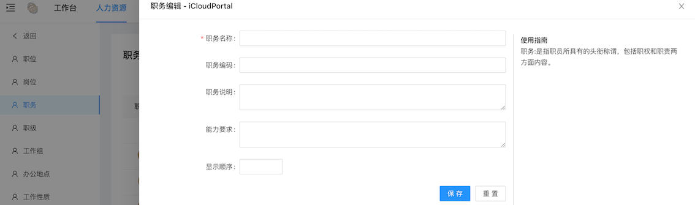

**4）职级**  

职级是工作的难易程度、责任轻重以及所需的资格条件相同或充分相似的职系的集合。  

依照分类不同，同一职级内的各个职位可以采取同一个称谓表示，同一职级内各个职位所需资格条件相同，可以采取同样的任职、考核和待遇标准。

**5）工作组**  

工作组是因某些工作或项目组建的小组，支持普通工作组和审批组两类

**6）办公地点**  

**7）工作性质**  

工作性质是组织与员工之间的用工形式，也称员工类型、员工性质。含全职、实习、外包、退休返聘等。  

可以选择根据实际情况设置启用或禁用某些工作性质。 

也可以设置工作性质是否参与人事统计。设置后，人事统计分析、员工档案库、人事仪表盘中会过滤不参与统计的员工。

**8）员工状态**  

工员工状态是指员工当前的工作状态，包括试用、正式、待离职、离职、产假、长期病假、停薪留职等，您可以选择启用或禁用某些工作状态。也可以设置是否参与人事统计。

**9）身份证件类型**

**10）人事合同类型**  

合同类型是指与雇员签署的人事合同、人事协议的类型，包含劳动合同、劳务协议等。可以选择性启用某些类型，或自定义更多的类型。

**11）调转类型**  

调转类型，即异动类型。

**12）调转原因**  

在异动调转中，调转原因关联调转类型。

**13）离职类型**  

离职类型一般分为主动离职和被动离职，您可以根据离职类型来设置不同的离职原因，并且还可以根据离职原因进行离职分析。

**14）离职原因**  

在离职管理中，离职原因关联离职类型。

**15）学历**  

**16）工时制度**

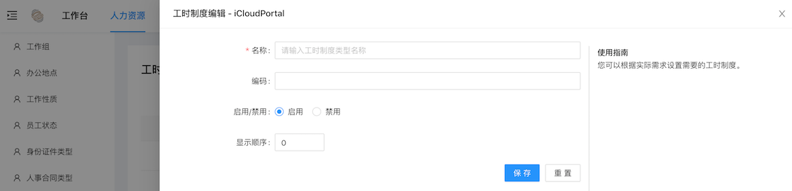

**17）证书/证件类型**  

**18）奖励类型**

**19）惩罚类型**

### 2.2 招聘管理
详情见  
[中小企业云门户招聘管理配置手册](http://readme.icloudportal.com/zh_CN/latest/%E4%B8%AD%E5%B0%8F%E4%BC%81%E4%B8%9A%E4%BA%91%E9%97%A8%E6%88%B7%E6%8B%9B%E8%81%98%E7%AE%A1%E7%90%86%E9%85%8D%E7%BD%AE%E6%89%8B%E5%86%8C.html)

### 2.3 培训管理
培训管理模块提供对培训需求、培训计划、培训项目的全过程管理，并重点实现对培训项目的培训效果评价和后续跟踪管理，不断提高培训实效。支持内部培训师和外部培训师管理。
#### 2.3.1 培训计划
点击添加按钮，可以添加新的培训计划。

#### 2.3.2 培训项目
点击添加按钮，可以添加新的培训项目。

#### 2.3.3 培训讲师
点击添加按钮，可以添加新的培训讲师。

#### 2.3.4 培训评分
点击培训评分，会跳转到问卷调查页面，可以根据不同的培训定制对应的培训评分问卷。

### 2.4 统计报表
在统计报表中，我们预制了4个常用报表，如果在使用过程中需要其他定制报表，可以与我们联系定制报表。

点击右上角的下载按钮，可以下载报表，点击下载后（当前为下载到云端），点击下载上边的按钮，可以查看下载进度，成功后点击可以保存到本地。

**员工花名册**

**员工通讯录**

**员工合同签订**

**员工工龄**

## 3 门户网站
专业的门户网站制作工具，可为公司定做官网。该模块目前不对用户开放，用户要使用的话可以联系我们，由我们来配置。下图为配置好的门户网站展示：

## 4 资产管理
自定义资产类别，便捷的入库、出库操作，告别原本的文档记录。  

资产管理模块包含固定资产管理、办公用品管理、资产库存报表、资产履历报表4部分，其中固定资产管理与办公用品管理模块操作、界面都一直，只是分类不同，这里只讲其中一个管理。

### 4.1 固定资产与办公用品管理

点击办公用品按钮，进入办公用品管理-资产履历页面。在这里可以按条件查询、查看资产履历，对资产进行入库、出库操作。  
新建立的组织，需要先设置资产类型，再到资产管理中新增资产，才能入库、出库。

点击入库、出库按钮，进行入库、出库操作。

在资产类型页面，可以对资产类别进行新增、删除、修改、查看操作。

**注：资产类型上级类别禁止循环嵌套，否则资产类别不会显示。**

在资产管理中，可以查看资产库存，新增、编辑、删除资产。

### 4.2 资产库存与履历报表
我们对资产库存与资产履历制作了报表，在这里可以打印、导出Excel、PDF等格式的报表。

## 5 合同门户

签章验证  可以使用adobe  

## 6 OKR目标管理
详情见  
[中小企业云门户ORK使用手册](http://readme.icloudportal.com/zh_CN/latest/%E4%B8%AD%E5%B0%8F%E4%BC%81%E4%B8%9A%E4%BA%91%E9%97%A8%E6%88%B7ORK%E4%BD%BF%E7%94%A8%E6%89%8B%E5%86%8C.html)
## 7 问卷调查
帮您轻松完成市场调查、社会调查、满意度调查等各类在线问卷调查。  

在问卷调查模块，可以新建、编辑、发布问卷，查看调查结果，下载调查报表。

### 7.1 问卷流程
点击添加问卷按钮，新建一个问卷调查。  

问卷包含：

> + 匿名问卷：何人收到问卷，都可以直接填写问卷；
> + 非匿名-个人问卷：需要填卷人通过手机号加验证码方式注册登陆，有云门户账户的可以直接使用云门户账户登陆填写问卷；
> + 非匿名-企业问卷：需要填卷人注册账号，并输入正确的企业信息如企业全称、组织机构代码等信息，已经在云门户注册过的组织，其中的员工可登陆账号直接填写问卷。  

在跳转地址中输入网址链接（例如公司官网链接），填卷人提交后会跳转到该地址。  

编辑问卷详细内容见本文7.2 问卷内容编辑

问卷编辑完成后，可以点击保存，再点击问卷卡片上的编辑按钮可以继续编辑问卷，点击发布按钮发布问卷。  

也可以点击保存并发布，直接发布问卷，问卷发布后，如过要重新编辑问卷内容，取消发布，再编辑发布。  

**注：取消发布后，编辑问卷内容，点击保存问卷后，需在弹出后点击保存按钮才会保存更改的问卷内容，直接关掉编辑问卷信息页面不会保存更改的问卷内容。**  

问卷发布后点击编辑按钮，最上方复制问卷链接，发送给需要填写问卷的人员即可。

匿名问卷的填卷人打开链接可直接填写问卷，右上角打印按钮可以打印问卷。

个人问卷需要填卷人手机号码或者云门户账号登陆，在右上角可以打印问卷和退出登陆，问卷填写为实时保存，文填写完退出，下次登陆可以继续填写。  

问卷提交后不可更改，想要更改需要问卷管理人员在调查结果中点击允许修改按钮，才可以修改问卷。

企业问卷和个人问卷类似，也是需要登陆，不是云门户注册组织的员工账户的填卷人，需要在手机号码登陆后，输入组织信息，完成注册，才能填写问卷。

问卷发布后，问卷卡片上回显示有多少人填写了问卷，点击更多中的调查结果可以查看问卷填写情况。  

点击问卷后的查看按钮可以查看改问卷的信息，点击允许变更按钮（匿名问卷没有该按钮），将该问卷改为未提交状态，该问卷填写者可以修改问卷重新提交。

点击设置按钮，可以添加和问题相关的检索条件。

点击导出按钮可以导出问卷报表，点击删除按钮，可以删除问卷。

### 7.2 问卷内容编辑
点击编辑问卷后边的编辑按钮，进入问卷内容编辑页面。  

默认进入问卷设计器页面，同时问卷设计器也是我们编辑问卷最重要的模块，也可以点击上方的测试问题、问卷逻辑、json编辑器来切换到其他模块。  

#### 7.2.1 问卷属性配置
**问卷整体属性**  

编辑问题前可以先点击下问卷设置按钮，属性编辑区域会显示调查问卷的属性配置，来配置下问卷整体属性，也可以点击邮编属性编辑区域的下来框，选择调查问卷，再进行编辑。

在一般属性中，可以配置问卷标题、说明，设置问卷语言及编辑模式。

标题和说明也可以在标题编辑区域编辑，还可以添加logo。

logo添加完成后可以调整logo位置，编辑、删除logo。同时在logo属性区域还可以微调logo位置。

在导航属性中，可以设置问卷相关的预览、按钮、进度条的自定义，如不设置，使用默认的按钮文本、进度条配置。

在问题属性中，可以设置问题的标题位置、问题说明位置、问题编号类型等问题相关的配置。

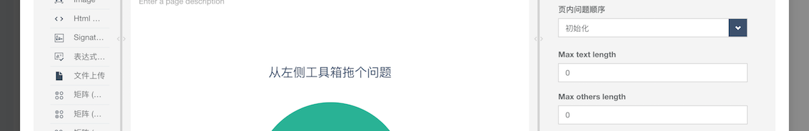

在页面属性中，可以新建页面，编辑页面名称、说明，以及删除页面。设置页面标题、页数的显示与否。  

同样在操作区也可以新建、切换显示页面，设置页面名称、说明。

点击页面后边的设置按钮，也可以编辑、删除、复制页面。

在逻辑属性中，可以设置答题时的一些逻辑，例如第一题答案为1时第二题才显示。

在数据属性中，可以设置数据刷新相关的设置。

在验证属性中，可以设置查错模式

在完成属性中，可以通过html代码自定义展示页面。

在问卷计时器属性中，可以设置填写问卷的时长限制。

**页面属性**  

在一般属性中，可以设置页面说明、是否可见、完成时长等信息。

在逻辑属性中，可以设置根据页面中某一问题的答案来确定是否可见、必选等逻辑条件。

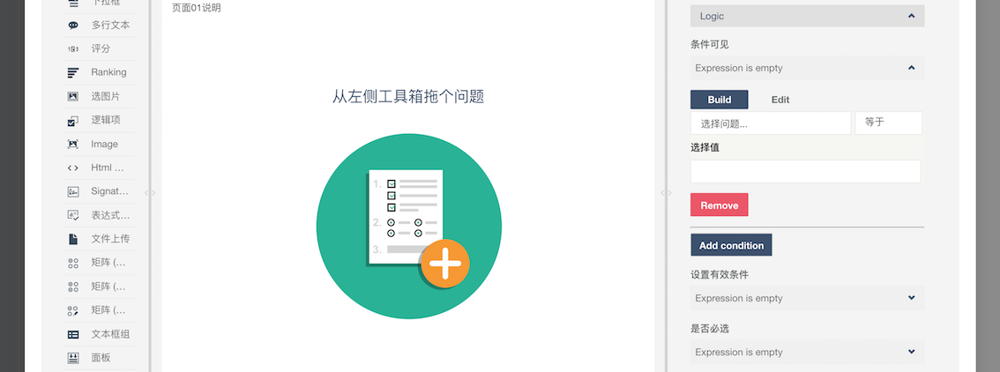

在布局属性中，可以设置问题相关的属性。

#### 7.2.2 工具箱
工具箱与流程表单配置时的流程组件类似，鼠标点击组件拖动到问题编辑区域即为添加问题，也可以鼠标单击组件完成添加。  

这里将依次介绍各个组件，以及组件的属性编辑，后续组件重复的属性编辑将不再说明。   

**单行文本**    

在一般属性中，可以设置题目名、题目文本、说明等基本属性。

点击文本框类型，可以选择文本框可输入的格式。 

占位文本为文本框提示文字，在文本框未输入信息是以灰色字体显示。

逻辑属性同页面的逻辑属性。

在页面属性中可以设置问题的标题相关信息，调整问题的大小。

在数据属性中，可以设置默认值，如果问卷问考试试卷可以设置正确答案。

在验证属性中，可以添加验证规则，当不符合规则时，发出错误提示，问卷无法提交。错误提示可在错误文字中自定义。

**多项选择**    

在设置选择属性中，可以设置多项选择的选项，添加全选、无、其他按钮，设置选项来源、选项顺序。

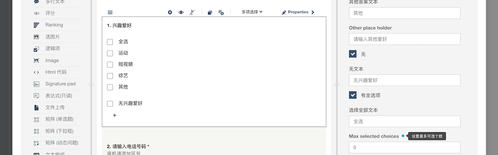

**注：部分问题组件在编辑时显示为英文，但是发布后会显示为中文。例如选择文本、”无“文本都是为了该文档显示才编辑的，实际使用中使用默认设置即可。**

点击编辑器按钮，可以设置逻辑来控制选项是否显示。

其他来源的选项可以通过导入url的方式导入选项。

**单项选择**    

单项选择配置与多项选择差不多，在配置选项属性中，可以设置清除选择按钮。

**下拉框**  

在配置选项属性中可以设置添加其他答案的的选项。

**多行文本**    

多行文本域单行文本配置相同，在布局属性中，可以设置多行文本的行数、列数。

**评分**    

在设置评分值属性中可以设置最大值、最小值、评分间隔。

也可以点击表单输入下方的新建按钮自定义评分选项，点击编辑器按钮可以为该选项设置逻辑，点击快速输入可以更简单的输入评分选项。

**Rangking（排名）**    

排名组件可以在设置选项中添加需要排名的选项，填写问卷时，点击选项前的按钮可拖动选项1以达到排名的目的。

**选图片**    

在一般属性中，可以设置图片多选、显示图片名称。

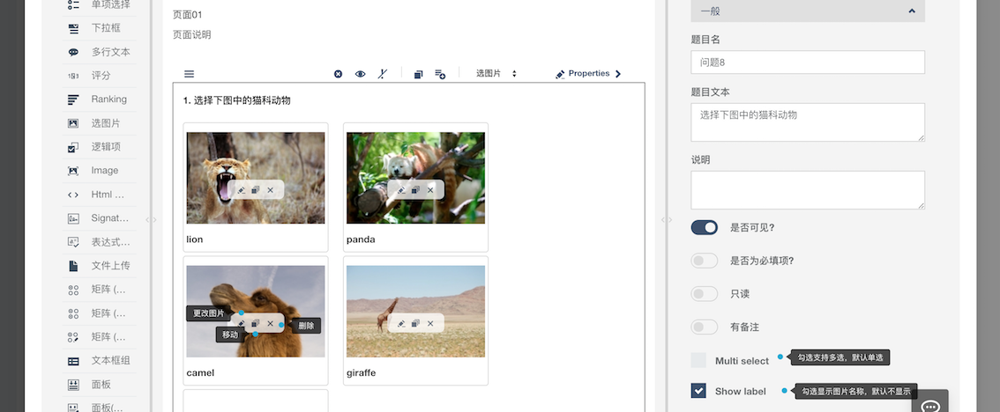

可以切换为选择图片。

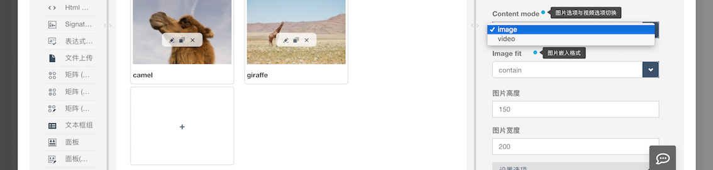

在设置选项中，通过图片链接的添加图片、视频。  

**注1：本地图片可以上传到我们的云门户资料库中，在通过共享链接来添加进选项。**  

**注2：点击图片中的编辑按钮可以替换图片，点击图片下方的添加按钮，可以添加新的图片，但是这样重本地上传的图片会存到服务器中，使用不方便，建议使用注1的方法添加图片。**

**逻辑项**   

在一般属性中可以设置逻辑为真或假时的文本。

**Image（图片）**    

图片组件只提供展示单独图片的功能，不
提供选择功能。

**Html 代码**    

可以在一般属性中的HTML中添加html代码，在问卷中就会显示代码所展现的东西了。

**signature pad（签名板）**  

在一般属性中可以设置签名板的大小，调整签字笔、背景板的演示，设置提交后签字板的存储格式。

**表达式（只读）**    

暂不支持  

**文件上传**    

在一般属性中可以设置上传多个文件、上传文件大小限制等属性

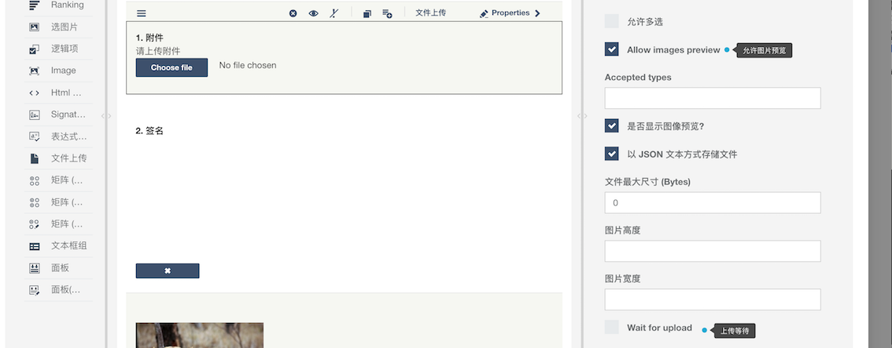

在其他属性中，可以设置删除文件时是否弹出确认。

**矩阵（单选题）**   

在设置列、行选项中设置矩阵的行列选项。在cells属性中可以把选择按钮替换成其他文本。在其他属性中可以设置允许拖拽行。

**矩阵（下拉框）**    

在一般属性中，可以在单元格类型中切换选项的形式，默认为下拉框。

在”Detail panel mode“中可以行或列中插入问题。

在设置行、列、选项中配置该矩阵的属性。

**矩阵（动态问题）**    

矩阵（动态问题）与矩阵（下拉框）类似，只不过动态问题可以增加删除行。

**文本框组** 

文本框组中可以设置多个单行文本类问题。

**面板**    

在面板组件中可以嵌入多个其他类型的问题。

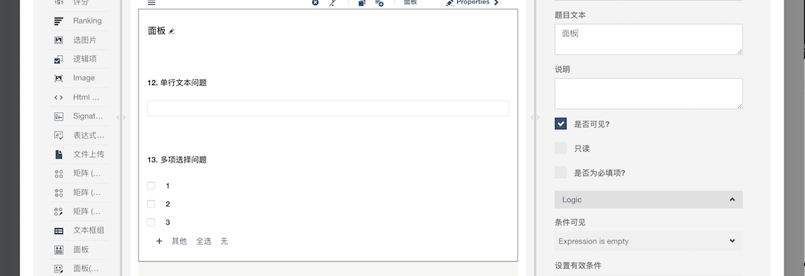

**面板（动态）**    

面板（动态）同样可以添加多种其他问题组件，并且有新增、删除一组的按钮。

**问题预览展示**

#### 7.2.3 测试问卷、问卷逻辑、json编辑器
在测试问卷中可以实时测试正在编辑的问卷，点击选择测试页面可以切换页面，点击选择设备可以查看问卷在不同的设备上的展示效果。

在问卷逻辑中，可以设置一些通过问题答案的逻辑表达式的结果，来实现一些动作，例如页面是否显示。

在json编辑器页面，可以复制json代码，粘贴到其他问卷中，达到复制问卷的作用。

## 8 组织设置
在组织设置中可以配置组织的基本信息和合作伙伴（关联组织暂未开放），这些信息将会在合同门户和项目管理系统中使用。

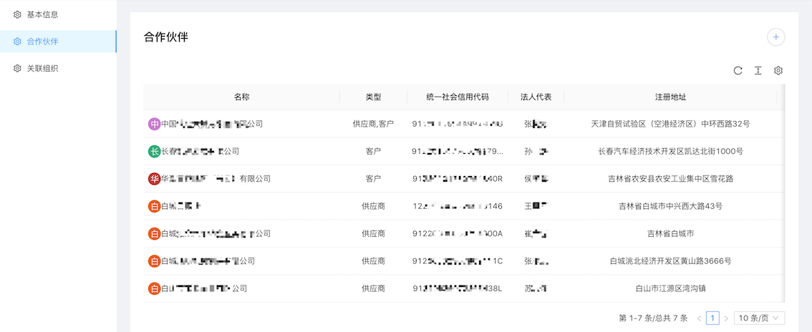

## 9 系统管理
系统管理中包含人员列表、角色列表和权限列表3部分，可以为员工分配角色，设置权限，配置菜单。  

在人员列表中可以查看各个员工的系统角色，不同的角色有不同的查看、编辑权限，点击角色后边的角色分配按钮，为员工分配角色。

在角色列表中可以设置角色，给不同的角色分配不同的权限。  

点击添加按钮，添加一个角色。

点击更新按钮，更改角色信息。

点击分配权限按钮，给角色赋予权限。菜单勾选意为改角色可以看到这个菜单，按钮勾选意为该角色可以操作选中的按钮。  

**注：没有按钮的菜单，只要员工有菜单权限就可以修改。**

点击删除按钮，删除角色。

在权限列表中，可以配置云门户菜单、按钮。  

**注：菜单配置一定慎重，可能导致菜单丢失等问题，如需配置菜单，请联系我们。**

