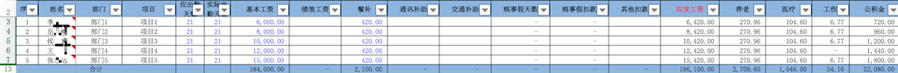
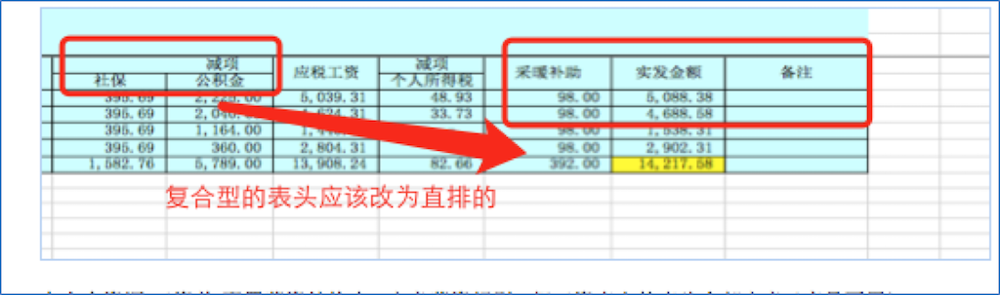
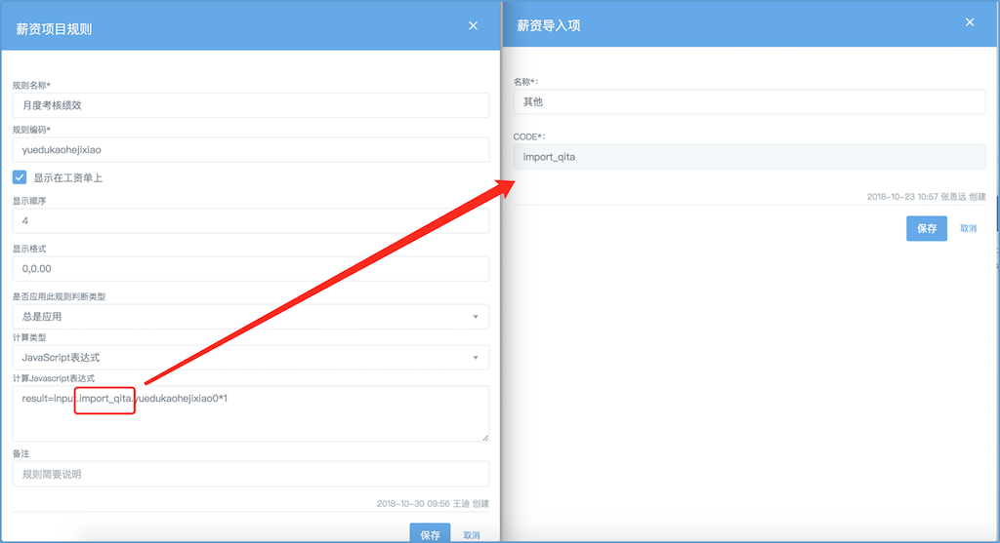
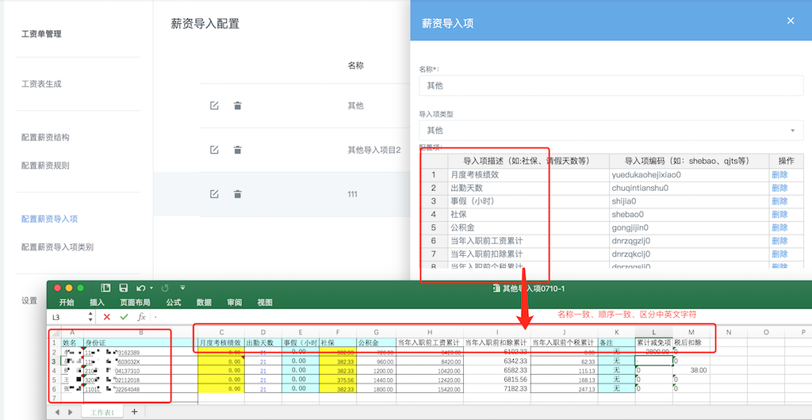

# 中小企业云门户工资单配置手册(支持2019新个税)
在使用工资单功能之前，我们需要进行一些符合目前组织结构工资表的设置。在这里，我们以下面的工资表为例，进行相关的配置。（该例子是按照全年累计计算个税的方法计算个税的，与其他计算方法不同点在个税计算公式这里，如果您是使用其他方法的请联系我们取得对应的个税计算公式。）

[工资表模板](./attachments/工资表模板_1.xlsx)

[其他导入项](./attachments/其他导入项.xlsx)

## 1 配置薪资规则
在配置薪资规则里吧工资单的表头全部定义（序号不需要）。

如果有的表头为复合型表头，则需要取消符合型表头，改为直排的。

点击右下角的“+”新建薪资规则。

**注：规则编码应以字母开头，可以包含数字，不能使用特殊符号。** 

若该规则所有人员的数值是一样的，计算类型选择固定金额，其他的全选择JavaScript表达式。

在这里我们把工资表中的各类薪资共分为3大类，获取数据的javascript表达式也不同。
### 1.1 固定薪资类别
基本工资、月固定绩效、通讯补助、采暖补助等每月都不会发生改变的薪资项目为固定薪资类别。表达式为：result=employee.salary.(薪资结构中的对应编码)

 **注：（）内为可变选项。**  

 **注：薪资结构中的对应编码见本文章第2章**  

例：基本工资

姓名的表达式是固定的：result=employee.name

银行卡号的表达式是固定的：result=employee.bank.no
需要在员工信息中设置银行卡号。

### 1.2 变动薪资类别
月度绩效考核、出勤天数、备注等每月可能变动的薪资类别为变动薪资类别。表达式为：result=input.(薪资导入项类别的编码).(薪资导入项的对应编码)

 **注：薪资导入项类别的编码见本文章第3章**  

 **注：薪资导入项的对应编码见本文章第4章** 

例：月度绩效考核

### 1.3 计算型薪资类别
餐补、应发工资、个人所得税等根据已有薪资类型计算出来的薪资类型为计算新薪资类别表达式为：result=payslip.(薪资规则里对应的编码)(加减乘除、大于、小于等运算符)(数字、payslip.(薪资规则里对应的编码)等)
例：餐补

当存在多个工资项目之间的计算时，我们需在每个项目后边*1。

### 1.4 2019新个税相关计算
#### 1.4.1 扣除累计和工资累计
在2019新个税计算中需要计算到当前月的（包含当前月的）累计工资、累计扣除，我们因此设定了一个计算公式：sumyear(payslip,employee,'(对应的薪资规则编码)')
扣除累计：

 **注：该公式计算时因为每月的扣除项是未加每月减免项，所以扣除累计里需加累计减免项。如若每月扣除项加了每月减免项则不需要加累计减免项。**  

工资累计：

#### 1.4.2 前N月个税累计
在2019新个税计算中需要计算到当前月之前的（不包含当前月的）累计个人所得税，我们因此设定了一个计算公式：sumyearBeforeN(payslip,employee,'(对应的薪资规则编码)')

#### 1.4.3 个人所得税
根据2019新个税的计算方法，我们制定了下面这个计算公式，使用时替换成对应的规则编码即可：

result=((
Math.max.apply(Math,[
(payslip.gzlj-payslip.kclj)*0.03-0,(payslip.gzlj-payslip.kclj)*0.1-2520,(payslip.gzlj-payslip.kclj)*0.2-16920,(payslip.gzlj-payslip.kclj)*0.25-31920,(payslip.gzlj-payslip.kclj)*0.3-52920,(payslip.gzlj-payslip.kclj)*0.35-85920,(payslip.gzlj-payslip.kclj)*0.45-181920])>0?
Math.max.apply(Math,[
(payslip.gzlj-payslip.kclj)*0.03-0,(payslip.gzlj-payslip.kclj)*0.1-2520,(payslip.gzlj-payslip.kclj)*0.2-16920,(payslip.gzlj-payslip.kclj)*0.25-31920,(payslip.gzlj-payslip.kclj)*0.3-52920,(payslip.gzlj-payslip.kclj)*0.35-85920,(payslip.gzlj-payslip.kclj)*0.45-181920
]
):0)
-payslip.gslj)>0?
(Math.max.apply(Math,[
(payslip.gzlj-payslip.kclj)*0.03-0,(payslip.gzlj-payslip.kclj)*0.1-2520,(payslip.gzlj-payslip.kclj)*0.2-16920,(payslip.gzlj-payslip.kclj)*0.25-31920,(payslip.gzlj-payslip.kclj)*0.3-52920,(payslip.gzlj-payslip.kclj)*0.35-85920,(payslip.gzlj-payslip.kclj)*0.45-181920])>0?
Math.max.apply(Math,[
(payslip.gzlj-payslip.kclj)*0.03-0,(payslip.gzlj-payslip.kclj)*0.1-2520,(payslip.gzlj-payslip.kclj)*0.2-16920,(payslip.gzlj-payslip.kclj)*0.25-31920,(payslip.gzlj-payslip.kclj)*0.3-52920,(payslip.gzlj-payslip.kclj)*0.35-85920,(payslip.gzlj-payslip.kclj)*0.45-181920
])
:0)-payslip.gslj:0

gzli:工资累计的规则编码。
kclj:扣除累计的规则编码。
gslj:个税累计的规则编码。

#### 1.4.4 1-N月的工资累计、扣除累计、个税累计
如果您不是从当年1月份开始使用本方法计算的工资单，那么扣除累计、工资累计、个税累计就调取不到之前月份的数据，这里就需要我们设置1-N月的对应的导入累计项。

在各个累计计算工资里加上导入的之前月累计项。

## 2 配置薪资结构
在这里我们将配置好的薪资规则组成薪资结构。

点击编辑按钮对已存在的薪资结构进行修改，点击删除按钮，删除对应的薪资结构。点击右下角的“+”按钮新增新增结构。

在配置项里设置工资单里的固定薪资类别。

 **注：固定薪资类别的薪资项目规则里计算公式所用的编码要与薪资结构配置项里对应的配置项编码相同。规则名称和配置项描述可以不同，但要记住对应关系。**  

薪资结构配置完成后，进入员工--->薪资福利中点击编辑按钮，选择薪资结构，设置固定薪资。

## 3 配置薪资导入项类别
变动薪资类别每个月需要我们手动导入Excel表格，我们需要在这里设置导入项类别，点击右下角的“+”，新建薪资导入项类别。

 **注：变动薪资类别的薪资规则中公式里的编码要与设置的薪资导入项code相同。**  

## 4 配置薪资导入项
薪资导入项类别配置完成后，在配置薪资导入项里，点击右下角“+”新建薪资导入项。

在配置项里设置工资单里的变动薪资类别。

 **注：变动薪资类别的薪资项目规则里计算公式所用的编码要与薪资导入项的配置项里对应的编码相同。规则名称和导入项描述可以不同，但要记住对应关系。**  

 **注：薪资导入项Excel表格中身份证号码与员工信息中的身份证号码一致，导入的数据才会生效。Excel中的数字格式不能设置千分位，会报错。要是没有备注信息，备注一栏填“无”。**  

## 5 工资表生成
点击右下角“+”生成工资表。

设置工资表名称、起止日期。

选择工资单内包含的员工。

导入薪资导入项，点击重新计算，工资计算完毕。

计算完毕后将完成改为选中状态（上图中为草稿选中状态），提交提交审批。

工资单流程审批设置在下边的设置里，具体设置方法请查看《中小企业云门户流程审批配置手册》。

审批通过后点击生效，员工可以在员工自助里查看工资单了。
