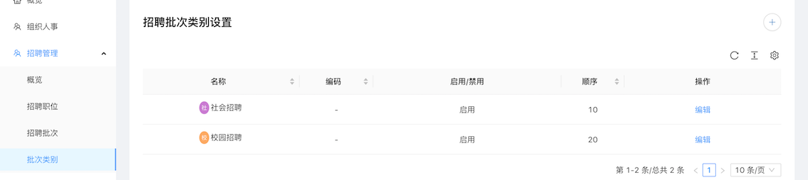

# 中小企业云门户招聘配置手册
在招聘概览中，可以看到职位、应聘情况的概览。

在批次类别中，可以根据不同的招聘情况，定义招聘批次类别。其中社会招聘和校园招聘为预制项，不可删除，不需要可以禁用。

在招聘批次页面，可以定义适用于各个批次类别的招聘批次。勾选发布按钮，批次生效。

批次类别和招聘批次都设置完成后，可以在招聘职位页面配置招聘网站、招聘岗位了。

## 1 配置网站首页
点击招聘网站按钮，在弹出的页面配置网站标题和标语，点击保存即可。

在点击保存后，在其旁边会出现一个去网站的按钮，点击即可跳到招聘网站首页。

## 2 招聘职位管理
### 2.1 添加招聘职位和职位发布
点击申请招聘按钮，在弹出的网页添加新的招聘需求，添加完成后点击申请按钮即可。

点击添加工作地址的按钮，可以新增工作地址，编辑、删除已有的工作地址。

点击职位下面左边按钮，编辑职位信息（**注：已发布的职位不可修改。**）。
点击中间的按钮可以发布职位，职位发布后可在招聘网站首页看到。

### 2.2 简历管理和职位删除
点击职位右下角的更多按钮，可以进行查看简历、删除职位。
#### 2.2.1 简历管理
点击查看简历按钮，可以查看、审核该职位已经投递的简历。

点击下载简历可以下载该应聘者投递的简历。

点击处理按钮，可以对应聘者整个应聘过程中的各个环节进行处理以及整个应聘过程是否通过。

**注：下图中只设置了一个环节，如有多个应聘环节，请联系我们。**

点击各个环节后边的处理按钮（上图标注处），可录入该环节的结果。

若某一环节结束，该应聘者不合格，点击弃用按钮，结束应聘。

若全部通过，点击通过按钮。

#### 2.2.2 职位删除
点击删除按钮，可将该职位删除。

## 3 招聘网站简介和应聘者应聘流程
应聘者可以通过访问我们的分享的网址来访问招聘首页。点击官方首页按钮会跳转到公司的官网首页。在按批次查看职位中，职位会按照工作地点分类。

### 3.1 应聘者注册登陆
应聘者点击登陆按钮，可通过手机号加验证码的方式注册登陆，如果注册了云门户账户，可以通过账户密码的方式登录。

登陆后点击右上角的按钮，点击我的简历，即可编辑个人简历，编辑完成提交即可保存。

点击我的投递，可以查看本人投递的各个职位历史，点击详细信息可以查看简历投递进展。

点击退出按钮即可退出当前登录。

### 3.2 投递简历
应聘者可以通过关键字搜索职位或在社会招聘开放职位中点击对应的城市查找职位。

进入职位列表后亦可通过关键字、工作地点、招聘类型来查找合适的职位。

点击对应的职位查看职位详细信息。

点击申请职位，投递简历。

投递完成后可以在我的投递中查看进程了。
未注册用户也可以投递简历，但是无法查看简历进程，只能等待邮件或电话通知。

