# 中小企业云门户缴费管理配置手册
在本文中，我们会详细讲解缴费管理和学生管理这2个模块。其中涵盖了缴费类型的新增与配置、新增学生、学生账单管理等相关内容。

## 1 缴费管理
点击缴费管理按钮，进入缴费管理界面，初次使用时，这里没有任何缴费类型，需要我们添加。

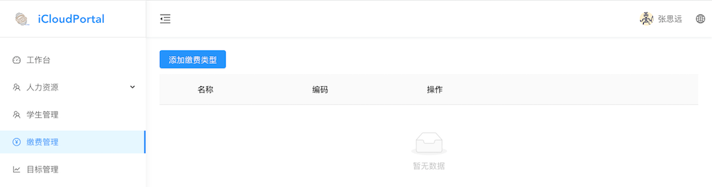

### 1.1 添加缴费类型
点击添加缴费类型按钮，在弹出的页面可以看到我们已经设计了一个不可编辑的通用模板————“教育缴费”，其中涵盖了学费、交通费、餐费3个项目，如果需求和这个差不多，可以直接使用这个模板。

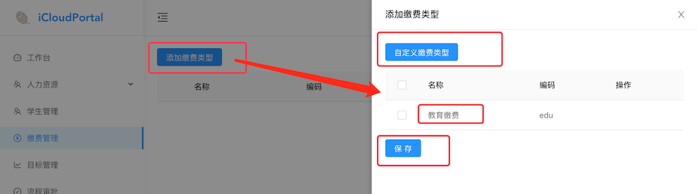

如果不使用初始模板的话，可以点击自定义缴费类型按钮，在弹出的界面填写自定义缴费类型的名称和编码，点击保存，自定义完成。

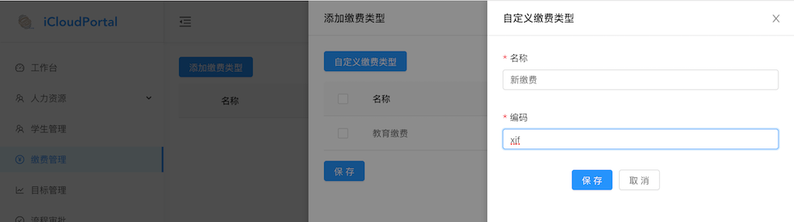

自定义的缴费类型可编辑、删除。

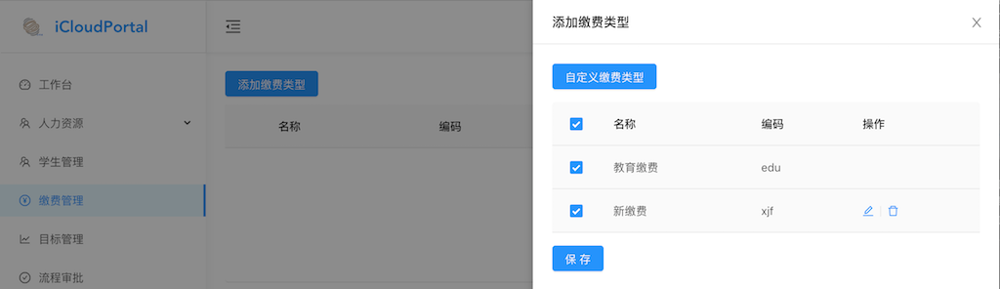

勾选想添加的缴费类型（可多选），点击保存，添加完成。
添加过的缴费类型不可重复添加，如下图，再次点击添加缴费类型时，已经添加过的缴费类型将不再显示。

添加完成后，如下图，我们可以看到缴费类型有3个操作按钮：项目设置、支付设置、删除按钮。

点击左侧的加号按钮，可以展开缴费类型，因项目未配置，所以显示暂无数据。

### 1.2 项目设置
点击项目设置按钮，在弹出的界面我们可以看到，教育缴费是预设置了3个项目，可以编辑、删除，也可以点击添加项目按钮新建项目。新建的缴费类型则没有预设置的项目，需要按照自身的需求添加项目。

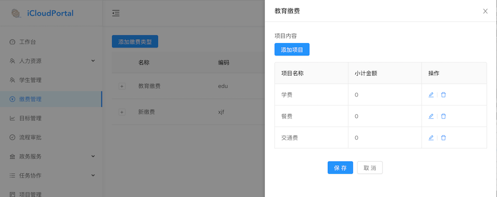

点击添加项目按钮，在弹出的界面添加项目名称、编码等信息，点击保存即可。

如上图，计算规则选固定金额，则该项目的费用为：固定金额*数量。这也是我们最常用的一种形式。
如下图，计算规则选择百分比的话，方便一些涉及到打折类收费的计算，但通过固定金额亦可以实现，所以不是很常用。

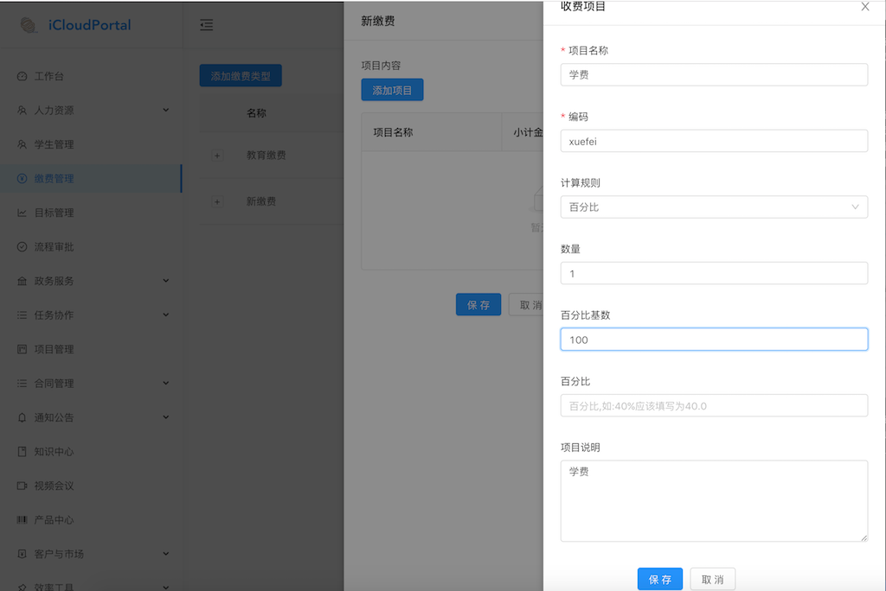

如下图，计算规则选择JS表达式的话，则是提供给了解编程的用户进行计算的方法。

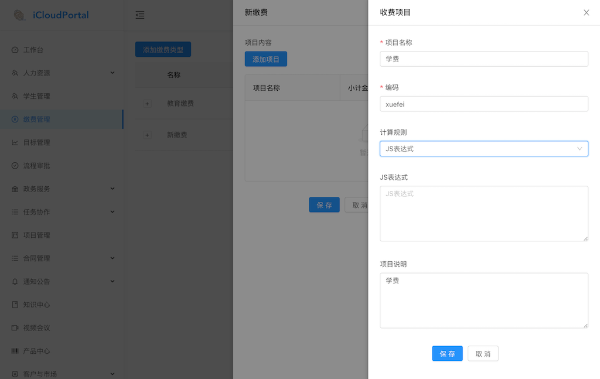

项目全部添加完成后，点击保存即可，可以看到缴费类型展开中有

### 1.3 支付设置
点击支付设置按钮，输入收费方小程序公众平台设置中的对应编码，点击保存。

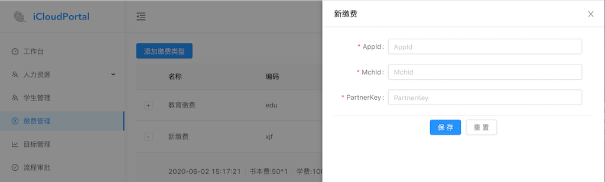

支付设置目前只支持微信支付，在后续的版本中，我们会逐步添加新的支付设置类型。

## 2 学生管理
在缴费类型都添加完成后，点击学生管理页面，可以给学生发账单了。新建的组织，并没有学生，所以需要我们先添加学生。

### 2.1 添加学生
点击添加学生按钮，在基本信息中添加学生的各项基本信息，在家庭信息中添加学生相关的家庭信息。点击保存，添加学生完成。
**注：基本信息和家庭信息需分别点击保存。**

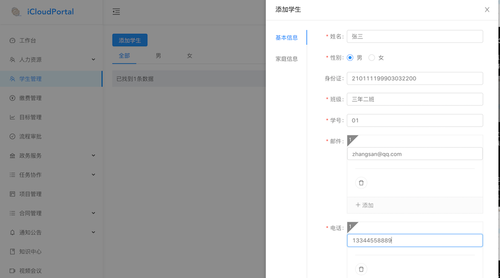

学生添加完成后，在学生管理界面就可以进行其他操作，如下图：

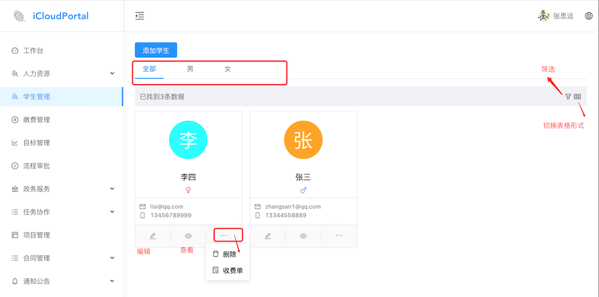

点击上方“男、女”选项可以按性别筛选学生。

点击右侧筛选按钮，可以按照学生姓名、创建日期等信息筛选学生。

点击右侧切换表格形式按钮，切换到表格展示形式，再次点击切换回卡片展示形式。

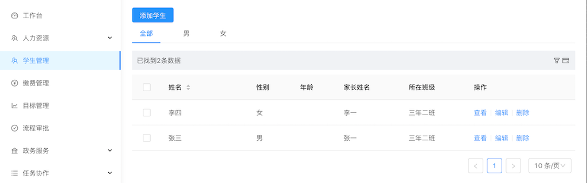

点击学生卡片下方编辑、查看按钮，可以查看、编辑学生信息。

点击学生卡片右下角按钮，点击删除按钮可删除学生，点击收费单按钮，即可跳转到收费单界面，为学生创建收费单。

### 2.2 收费单
点击学生卡片右下角按钮，点击收费单按钮，即可跳转到该学生收费单界面，在收费单一览界面，可以为学生配置收费单。在账单一览界面，可以查看学生的账单详情。

#### 2.2.1 收费单一览
点击添加收费单按钮，填写收费单的相关信息，其中标记"*"的为必填项。

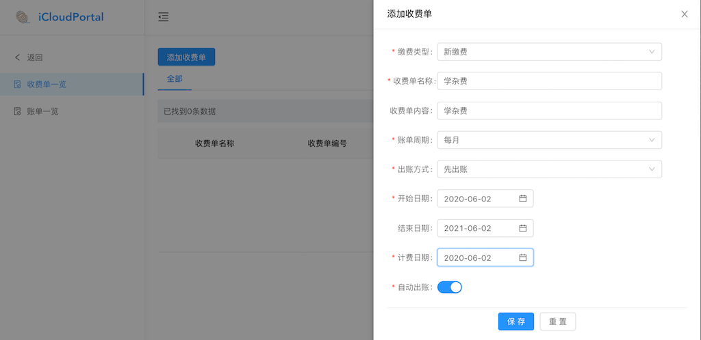

缴费类型为之前添加的所有缴费类型中选择一种。

账单周期共提供了4中方式，根据不同的需求，选择对应的账单周期。

出账方式为先出账和后出账2中形式，即先交费或后交费。

自动出账勾选后会按照计费日期和出账周期，到了日期后会自动出账单。

点击更多操作中的项目变更按钮，可以修改缴费类型中的项目配置。

点击收费单附件按钮，可以在弹出的界面上传附件。

点击修改按钮，可以修改收费单的内容。点击执行按钮，收费单开始生效，在到达设定的日期时，会自动生成账单，这是我们可以去账单一览查看、操作。

**注：收费单执行后，不可以修改收费单，需暂停执行才可修改收费单，修改后的收费单再执行，会在下一次生成账单时生效。**

在收费单一览中，我们可以设置多个周期性、一次性的账单。点击右侧的筛选按钮可以根据收费单名称、编号来查找对应的收费单

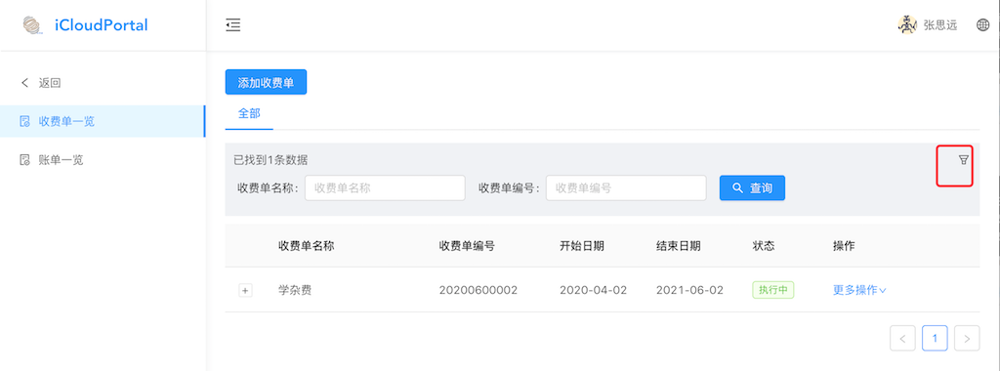

#### 2.2.2 账单一览
点击账单一览按钮，进入账单一览页面，这里已经有了一个生成的账单了。
点击右侧的筛选按钮，可以根据账单号来查询对应的账单。

点击查看按钮可以查看账单的详细信息。

点击更多操作中的处理账单可以修改账单中的项目配置。

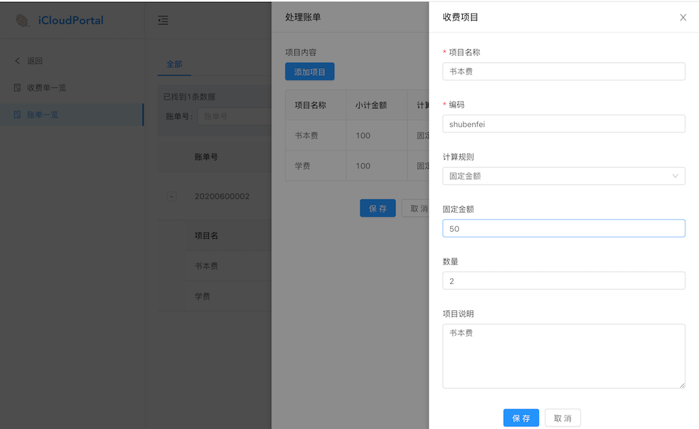

确认账单无误后，点击发送账单，将账单发送至缴费者那边。
**注：发送后无法修改账单。**

如缴费者在现场，可点击支付账单按钮，缴费者通过微信扫码缴费。

