# 云门户大学使用手册-学生版
访问 https://ilearning.icloudportal.cn/ 进入云门户数字企业大学首页。在这里可以看到一些课程的简介、日历等。

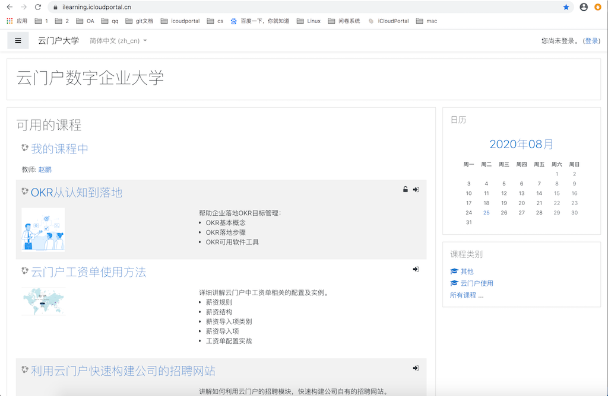

点击右上角的登陆按钮，跳转至登陆界面，在这里有两种登陆方式，云门户账户登陆（需要注册云门户账号）、以访客身份登陆（无需注册）。

点击以访客身份登陆，进入云门户数字企业大学首页（访客页面）。

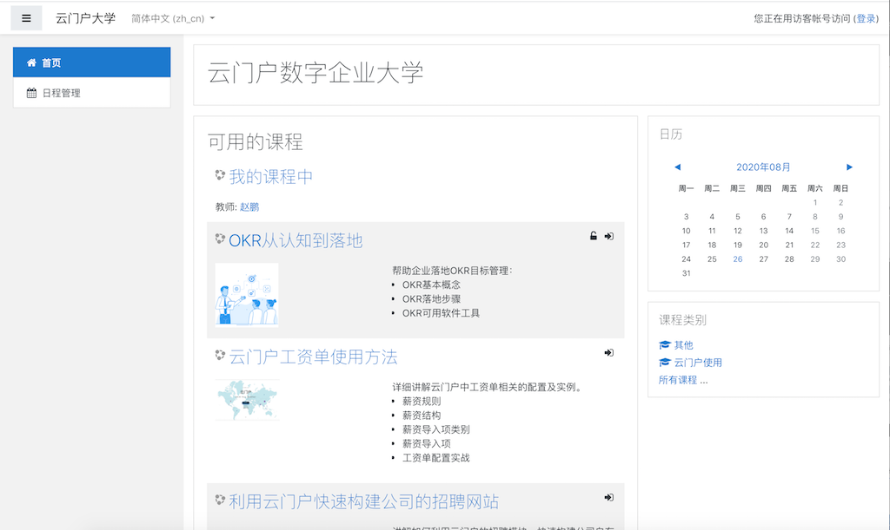

访客只能学习公开向访客的课程，不能将课程添加到”我的课程“中。

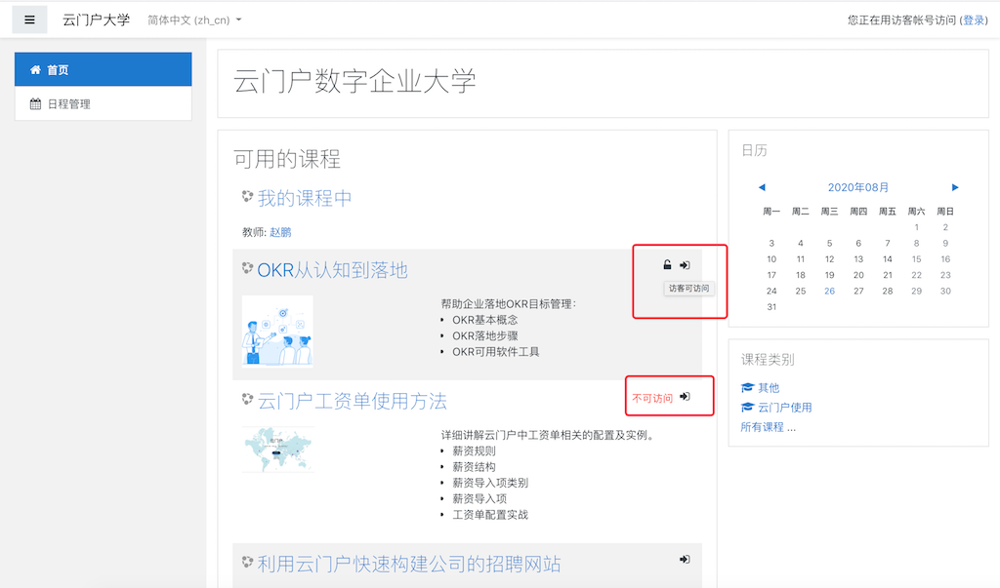

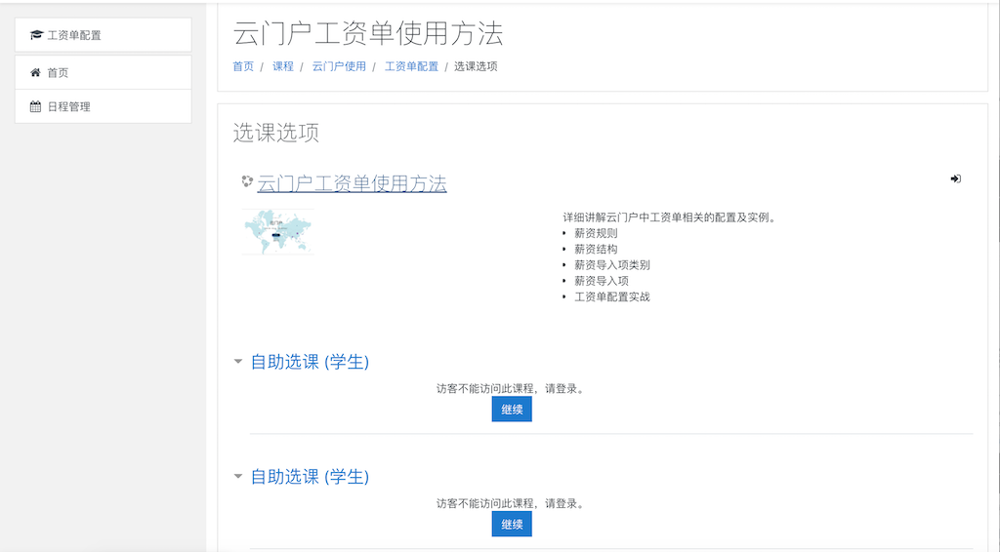

点击云门户登陆，输入账号密码，进入云门户数字企业大学首页。

**注：未注册人员可以在登陆页面注册账号。**

## 1 个人主页
登陆成功后，进入到个人主页页面，在这里我们可以看到该账户最近访问的课程、学习中的课程概览、活动的时间轴、私人文件等相关信息。

点击右上角的自定义此页按钮，可以自定义个人主页的布局、板块信息。点击板块右上角的移动按钮，可以配置板块布局。点击右上角的设置按钮，可以配置、隐藏、删除该板块。

### 1.1 语言
点击左上角的语言按钮，可以切换本网站的中英文显示。

### 1.2 通知
右上角铃铛图标显示通知，点击可查看未读通知，点击√按钮，可把所有未读通知改为已读。点击右上角的设置按钮，可以配置通知的提示形式。点击底部的查看全部按钮，可查看所有通知。

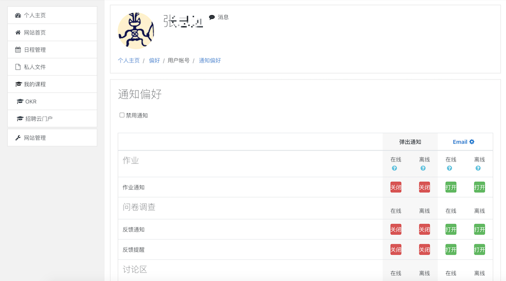

### 1.3 消息
点击在线用户后边的消息按钮可以开启聊天，聊天对象可以在右上角的消息按钮查看并回复消息。
**注：认证用户无法聊天，角色为学生后可以聊天。**

点击右上角设置按钮，可以设置消息的相关配置。

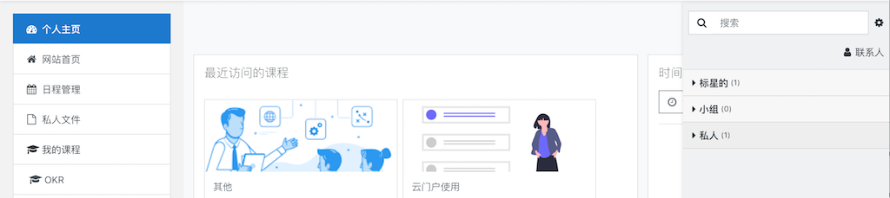

点击联系人按钮可以查看联系人，接受联系人申请。

在聊天时，点击上边对方头像，可以添加为联系人或屏蔽用户。点击右上角的操作按钮，可以对该聊天进行设置。

## 2 个人信息
点击右上角的用户按钮，展开个人信息编辑菜单。

### 2.1 个人档案
点击个人档案按钮，进入个人档案界面。右上角的按钮为偏好按钮，我们将在1.4章详细讲解。

点击编辑个人档案按钮，可以对个人信息进行编辑。

在课程详情中点击已有的课程，可查看自身在该课程中的角色。

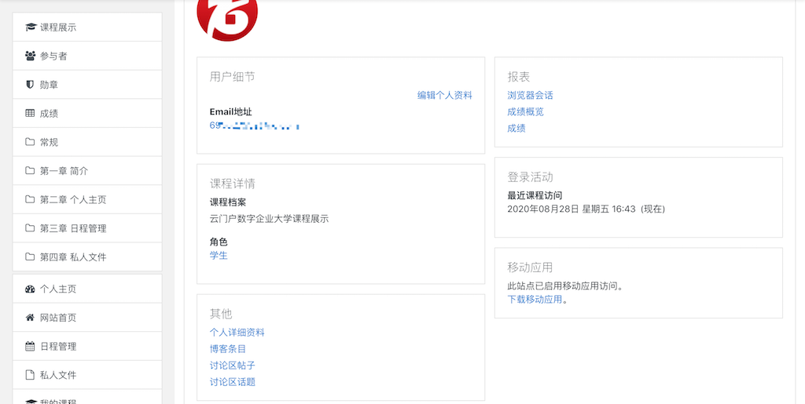
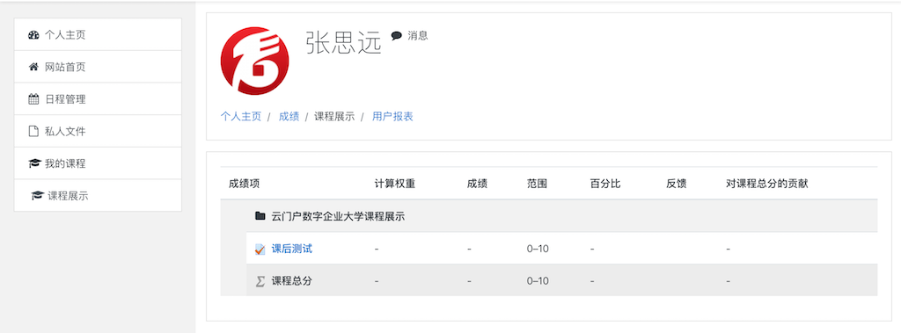

在报表中，我们可以查看浏览器会话、成绩等信息。

在登录活动中查看自己的登陆信息。在博客条目中查看、编写自己的博客。

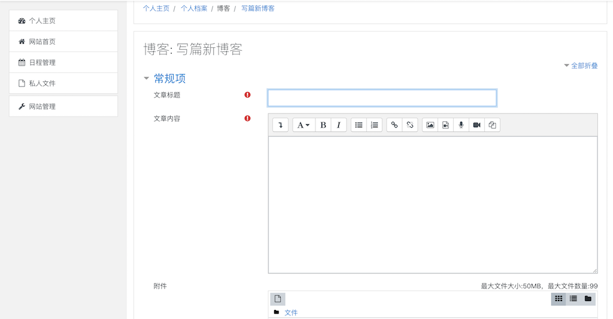

查看在讨论区发布的话题、帖子。

移动应用未实装，请关注新版本。

### 2.2 成绩
在成绩一栏，我们可以查看自己正在学习的课程信息点击课程查看成绩详细信息。

**注：关于成绩的详细信息请看本文第6.2章。**

### 2.3 消息
消息功能与第1.3章的功能一致，只是展示方式不一致。

### 2.4 偏好
在个人偏好设置里，我们可以对用户账号、博客、勋章设置个人偏好。

#### 2.4.1 用户账号
1） 编辑个人资料

同第2.1章个人档案中的编写个人资料。

2） 偏爱的语言

同第1.1章语言

3） 讨论区选项

4） 编辑器选项（保持默认即可）

5） 课程设置（默认即可）

6） 日历偏好

7） 信息偏好

同第1.3章消息设置。

8） 通知偏好

同第1.2章通知设置。

9） 管理第三方登陆

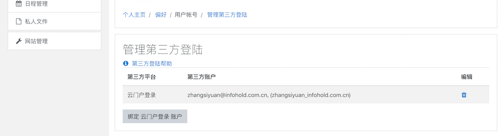

#### 2.4.2 博客
1） 博客偏好

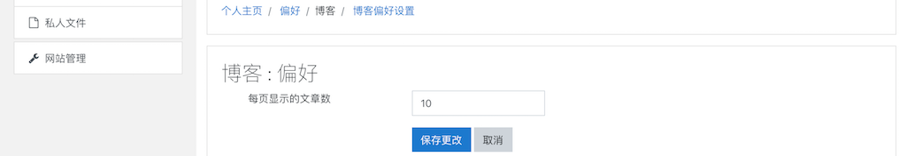

2） 外部博客

3） 注册外部博客

#### 2.4.3 勋章
1） 管理勋章

2） 勋章偏好

## 3 网站首页
在网站首页，我们可以看到现在可以学习的课程和课程类型、日历。

点击增加想要学习的课程，如果该课程为公开课程，可以直接访问学习

如果该课程为人工选课，请联系该课程教师，将你添加到课程中。

如果该课程为自助选课，点击将我加入，将你添加到课程中。

选课成功后就可以开始学习了，同时再次访问首页时，左边菜单栏出现新的菜单-我的课程，下边会显示已选课程。

点击课程右边的配置按钮，可以退出本课程的学习。

点击左边的参与者按钮，可以查看当前参与课程人员。

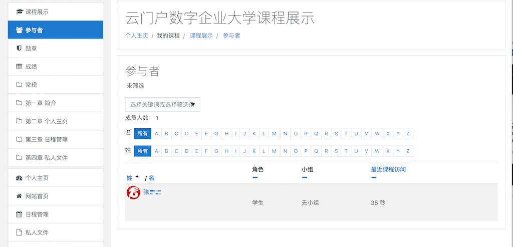

点击勋章按钮可以查看获得的勋章。

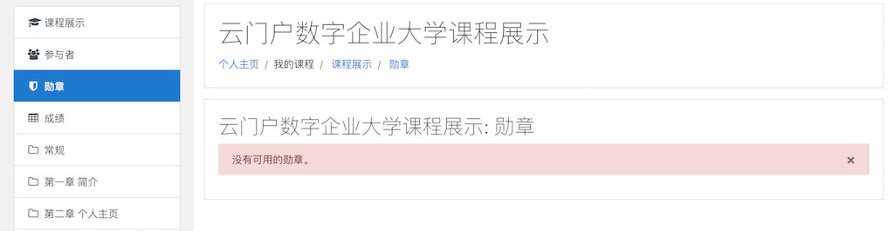

点击成绩按钮，可以查看参与过的测试的成绩。

## 4 日程管理
在日程管理界面，我们可以新增、编辑、删除事件。

点击日历左上方的按钮，可以切换查看事件的方式。

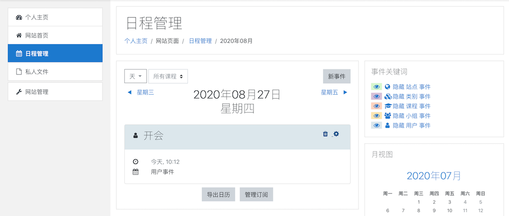
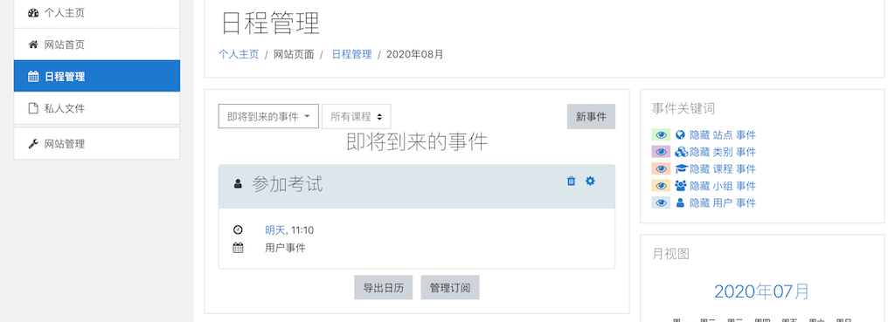

点击新事件可以新建事件。

点击导出日历可以将事件导出，加入其它日历中。

点击管理订阅可以到入日历事件。

在事件关键词里，我么可以按照类别隐藏或显示事件。

事件添加完成后，我们可以在个人主页的日历、即将到来的事件
和网站首页的日历中看到事件。

## 5 私人文件
在私人文件页面，点击添加按钮可以上传私人文件，上传完成后点击保存更该按钮才会保存。

点击新建文件夹按钮可以在当前目录下创建新的文件夹。

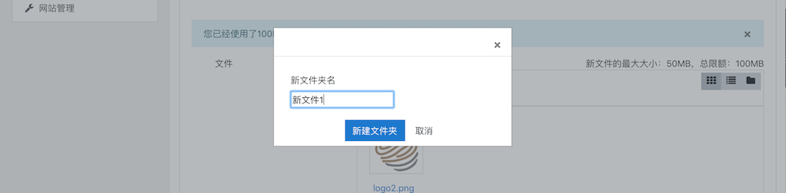

点击下载全部按钮可以下载私人文件中的全部文件。

点击单个文件，可以查看、下载、修改、删除文件。

右上角的3个按钮可以切换文件的显示形式。

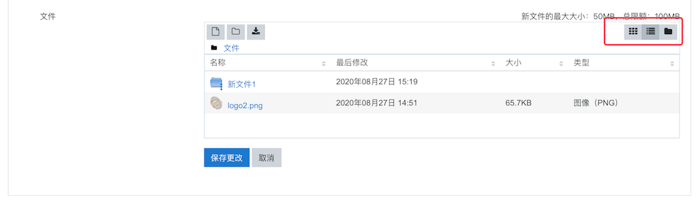
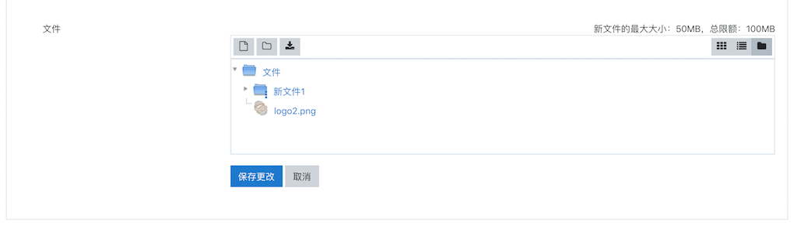

